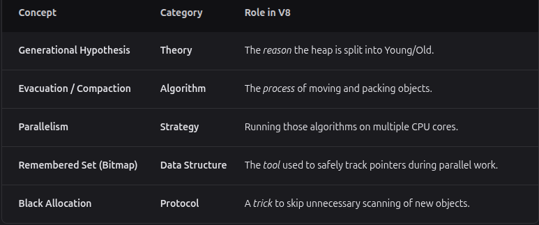

# Garbage Collection — V8 Orinoco Overview

V8’s Orinoco garbage collector is built to reduce "jank" (visual stutter) by avoiding purely sequential, stop-the-world collection cycles. Orinoco uses parallel and concurrent strategies to keep JavaScript performance smooth.

## Core Concepts

### Generational Hypothesis

- Most objects die young.
- The heap is divided into:
  - **Young Generation** — short-lived objects.
  - **Old Generation** — long-lived objects.

### Young Generation Evacuation

- Objects are evacuated inside the young generation or promoted to the old generation.
- This work is performed in parallel across multiple threads.

### Parallel Compaction

- Orinoco compacts the old generation by moving live objects to more tightly packed pages.
- Parallel compaction reduces fragmentation and improves performance.
- Average compaction time is roughly **75% lower** than older approaches.

### Parallel Remembered Set Processing

- V8 tracks inter-generational pointers using **remembered sets**.
- Orinoco replaced the older store-buffer array with a **bitmap-based structure**.
- This design simplifies parallel updates and helps prevent data races.

### Black Allocation

- Objects promoted to or directly allocated in the old generation are marked **black** (live) immediately.
- These objects are skipped during the current GC marking phase, improving efficiency.

## Illustration

