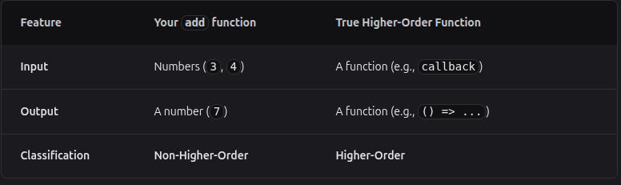

# Higher-Order Functions in JavaScript

Higher-order functions are a core concept in JavaScript that make code more reusable, expressive, and easier to read. A higher-order function is simply a function that either takes another function as an argument or returns a function.

## Core Concepts

### Functions as First-Class Citizens

- Functions can be stored in variables.
- Functions can be passed as arguments to other functions.
- Functions can be returned from other functions.

Because of this, JavaScript treats functions like values, which enables powerful patterns such as callbacks and functional programming.

### Definition of a Higher-Order Function

- A function that accepts another function as an argument is a higher-order function.
- A function that returns another function is also a higher-order function.

### Common Examples

- `map()` — transforms each element of an array.
- `filter()` — selects elements that match a condition.
- `reduce()` — combines array values into one result.
- `forEach()` — runs a callback for every element.
- `setTimeout()` and `addEventListener()` — accept callback functions.

### Why `map()`, `filter()`, and Similar Functions Are Higher-Order

These methods are higher-order because they take another function as an argument. That function is usually called a callback.

- `map(callback)` receives a function and uses it to transform every item.
- `filter(callback)` receives a function and uses it to decide which items should stay.
- `reduce(callback, initialValue)` receives a function to combine values step by step.
- `forEach(callback)` receives a function and executes it for every element.

#### Internal Structure

Internally, these methods follow a common pattern:

1. They iterate over the array.
2. For each element, they call the provided callback function.
3. They use the callback's returned value to build the final result.

```js
const nums = [1, 2, 3, 4];

const doubled = nums.map(function (n) {
  return n * 2;
});

console.log(doubled); // [2, 4, 6, 8]
```

In this example, `map()` is higher-order because it does not itself know how to transform the element. It depends on the callback function passed by the programmer.

That is the key idea: the outer function controls the iteration and structure, while the callback defines the behavior.

## Why They Matter

### Reusability

- One function can work with many different behaviors.
- Logic can be written once and reused with different callbacks.

### Cleaner Code

- Code becomes shorter and more declarative.
- Complex loops can often be replaced by readable function-based patterns.

### Functional Composition

- Small functions can be combined to build more powerful behavior.
- This makes programs easier to test and maintain.

## Example

```js
const numbers = [1, 2, 3, 4];

const doubled = numbers.map((num) => num * 2);

console.log(doubled); // [2, 4, 6, 8]
```

Here, `map()` is a higher-order function because it takes a callback function as an argument.

## Another Example

```js
function multiplyBy(factor) {
  return function (num) {
    return num * factor;
  };
}

const double = multiplyBy(2);
console.log(double(5)); // 10
```

This example shows that a function can return another function, which is also a higher-order function pattern.

### Nested Function vs Higher-Order Function

```js
function add(a, b) {
  function add2(x, y) {
    return x + y;
  }

  return add2(a, b);
}

console.log(add(3, 4));
```

- `add2()` is nested inside `add()`.
- It has access to the outer function's scope.
- However, this is still not a higher-order function because it does not receive a function as an argument or return a function as a result.

```js
function makeAdder(a) {
  return function (b) {
    return a + b;
  };
}
```

- This is a true higher-order function pattern because it returns a function.
- The returned function can be used later as a value.

### Comparison



## In Short

Higher-order functions help JavaScript programs become more flexible and expressive. They are one of the most important features of modern JavaScript and are widely used in real-world applications.
